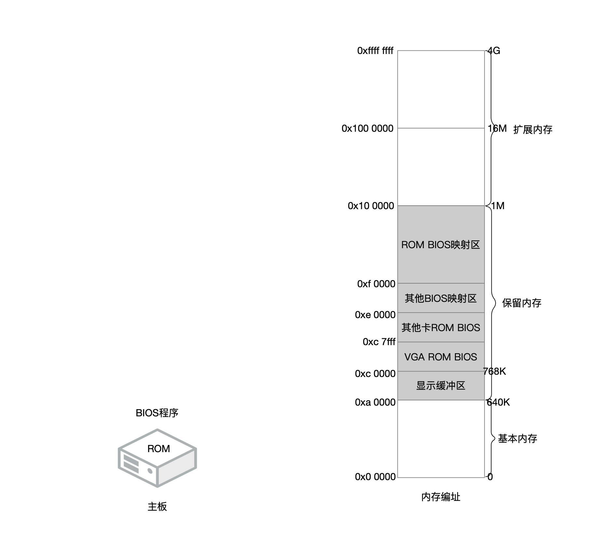
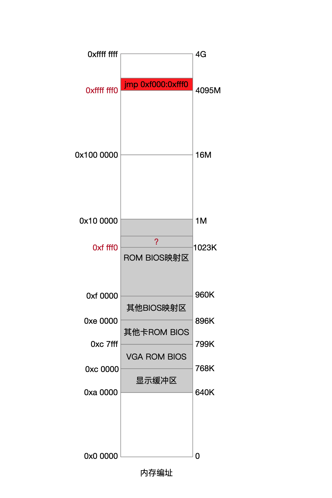
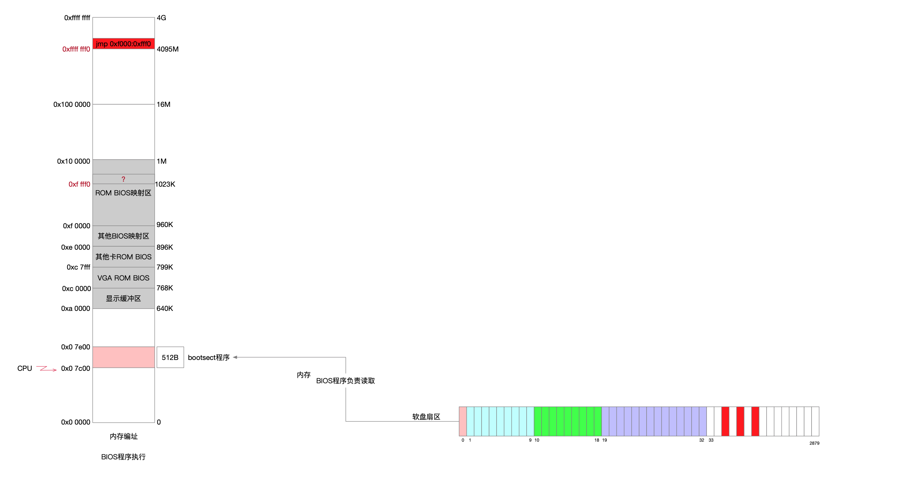
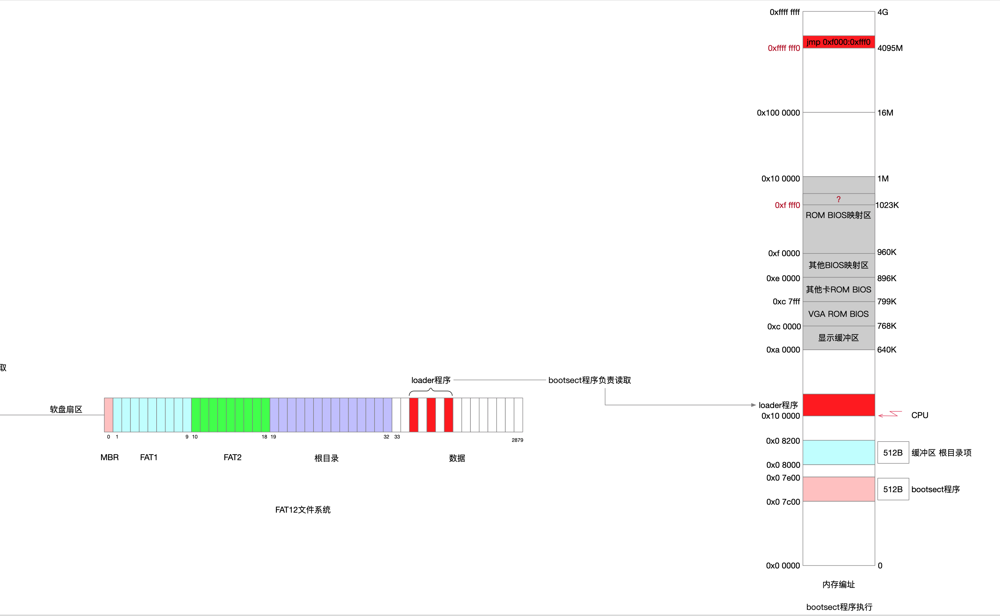

## MY-OS

### 1 调试平台

一开始用的是MAC系统来调试引导程序，BIOS切换CPU执行权，执行boot程序是没有问题的。

之后在boot程序中构建了FAT12文件系统，用其加载loader程序，这个时候在挂载目录文件这个地方遇到了坎，因此放弃了MAC平台的调试方案，转而到Linux系统。

* [MAC平台](./docs/MAC.md)
* [Linux平台](./docs/CENTOS.md)

### 2 程序文件

操作系统程序也是源码，分为3批加载到计算机，加载的语义是，程序都在软盘上，要加载到计算机内存上，供CPU寻址。

| 程序   | 名称     | 持久化位置 | 加载方     | 内存位置      | 主要功能职责          |
| ------ | -------- | ---------- | ---------- | ------------- | --------------------- |
| BIOS   | BIOS     | 主板ROM    |            |               | 加载bootsect          |
| 第一批 | bootsect | 软盘扇区0  | BIOS程序   | 0x0000:0x7c00 | 加载第二批\第三批程序 |
| 第二批 | loader   |            | 第一批程序 | 0x1000:0x0000 |                       |
| 第三批 | setup    |            | 第一批程序 |               |                       |

### 3 FAT12文件系统

[为1.44M软盘设计文件系统](./docs/FD.md)

### 4 内存布局

内存是个动态的组织结构，所以对内存的布局规划得结合各个时机来看

#### 4.1 关机

在没开机的时候

* 内存(RAM)是空的
* BIOS程序存储在主板上一颗芯片的ROM中

即使现在内存是空的，也并不影响内存编址，这是一个逻辑上的概念，是一种规范定义，将内存分为3个部分

* 基本内存 源于对古早概念的兼容，以前使用场景和技术手段下1M内存是够用的，现在仍然保留了对其称呼
* 保留内存 对于程序视角而言不可用，约定这一块内存另作他用，这也就给后续的操作系统规划内存提出要求
* 扩展内存 超过1M的都叫扩展内存，本质同基本内存一样，只是绝对地址不同而已

#### 4.2 上电

这一块我自己还没梳理清楚，或者说版本太多，个人认知无法理解

之前看的一本书叫<<系统内核的优雅设计>>，书中简单描述了上电启动流程为：在CPU层面将CS=0xf000，IP=0xfff0，CPU会去寻址，这个内存地址上放的是一条jmp指令，要跳去的位置正是BIOS程序地址。

如上描述的结合我看到的其他说法就可以整理出如下几个疑惑

* CPU寻址的矛盾

  * <<系统内核的优雅设计>>这本书举的例子是16M内存，CPU工作在16位实模式下，地址线用低20位，段地址寻址=CS<<4+IP=0xffff0，这是一个1M一下低地址空间

  * 又有一种说法在现在计算机上，CPU上电后寻址的是0xfffffff0，4G以下高地址，这明显用的是32位地址线寻址，也就反证CPU不是运行在实模式下，此时没有任何操作系统和程序，是谁在负责A20地址线切换

* 跳转指令，姑且认为CPU寻址的是0xffff0低地址，现在内存上是空的，里面哪儿来的跳转指令

  * 一说，跳转指令是BIOS程序一部分
    * 那么即使是一部分，这条指令又是如何能让CPU寻到的呢
    * 既然已经是BIOS程序主体一部分了，为什么不直接跳到BIOS程序起始地址
  * 二说，影子内存技术手段，RAM内存没有使用，映射到ROM中，那么是不是存在这样的伪代码`if 0xf0000<x<0x100000 read ROM(x)`
    * 这样的判定逻辑谁负责的
    * 很明显ROM的读取效率是要比RAM低下的
    * 还是说RAM再退化成ROM的缓存，如果这样的话，还得继续丰富上面的伪代码
  * 三说，CPU寻址之前，ROM中的BIOS程序已经放到了内存上，就在[0xf0000...0x100000)上，这里面包含了BIOS程序的代码和数据，0xffff0上面又放了一条jmp指令，这条指令再跳到BIOS程序起始处
    * 这样的话CPU就不是第一时刻被通电的，因为CPU很单纯就是不断取址执行，如果是第一时刻被通电，必然第一时刻去寻址，但是内存上还没有内容
    * 因此第一时刻工作的是负责把BIOS程序从ROM复制到RAM的组件，这个是谁在负责，怎么复制的
    * 基于上述，它还得在复制完程序之后，给CPU供电

#### 4.3 BIOS程序

BIOS程序功能很多，我们只关注主线的任务-加载bootsect程序

以软盘做启动引导为例

* BIOS将软盘第一扇区的512B内容读到内存[0x07c00...9x7dff]上
* BIOS读到最后1个word内容是0xaa55，判定这是启动引导程序
* BIOS jmp到0x07c00，做好了执行bootsect程序的准备

#### 4.4 bootsect程序

* 为软盘构建了FAT12文件系统
* 将文件系统中LOADER.BIN这个文件读到内存
* loader程序被放在内存0x100000地址上
* bootsect程序jmp到0x100000，做好了执行loader程序的准备
