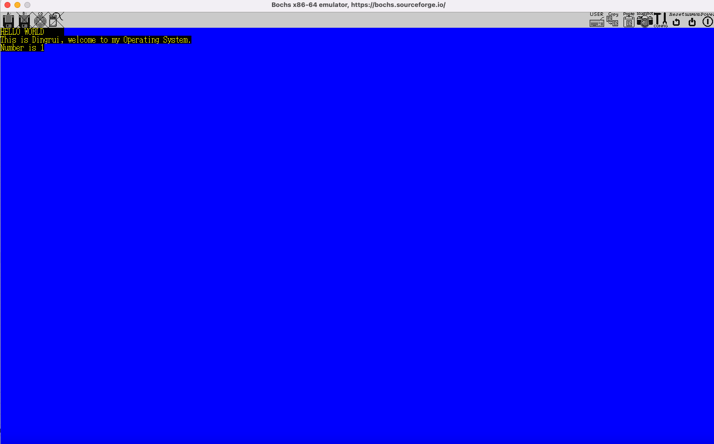

## MY-OS

在[TUTORIAL](https://github.com/Bannirui/tutorial.git)中有记录当时学习的操作系统相关的知识

[TODO list](./TODO.md)


## 1 QUICK START

```sh
chmod +x build.sh

build.sh
```

效果图




## 2 TIPS

- 调试的时候不方便写调试代码 直接检查`hexdump -C build/kernel/kernel.bin`