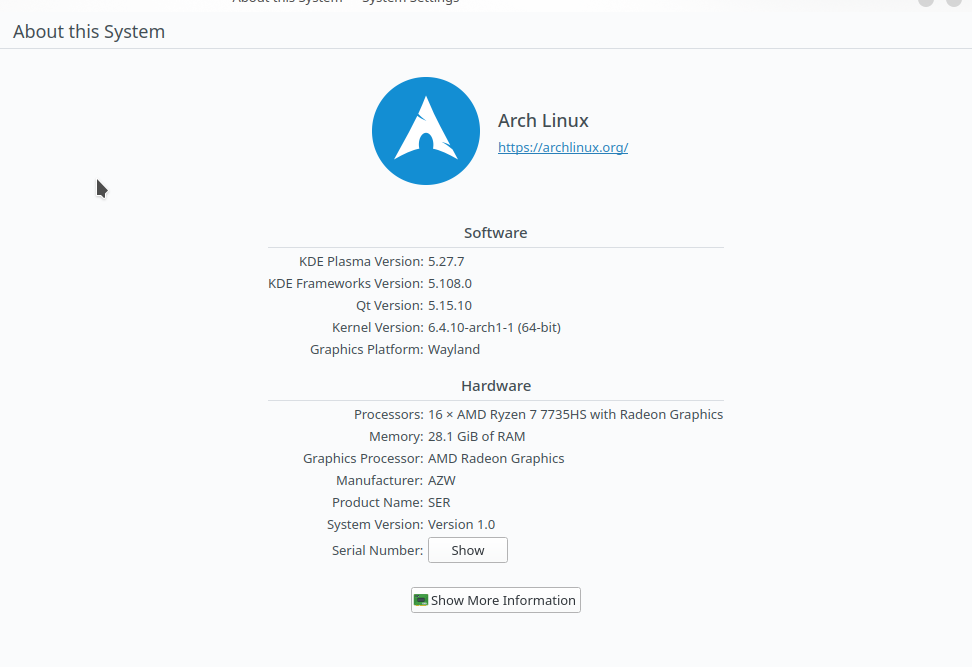
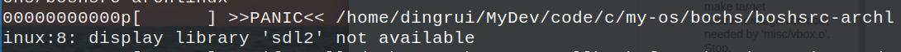

## ArchLinux



### 1 Bochs

#### 1.1 download

https://sourceforge.net/projects/bochs/files/bochs/2.7/

#### 1.2 build

```shell
cd Documents/software/bochs
cp ~/Downloads/bochs-2.7.tar.gz ./
tar -zxvf bochs-2.7.tar.gz
mv bochs-2.7 bochs

make dist-clean
```

```shell
./configure \
--with-x11 \
--with-wx \
--enable-plugins \
--enable-debugger \
--enable-debugger-gui \
--enable-readline \
--enable-xpm \
--enable-show-ips \
--enable-logging \
--enable-assert-checks \
--enable-cpp \
--enable-idle-hack \
--enable-cpu-level=6 \
--enable-smp \
--enable-fpu \
--enable-3dnow \
--enable-x86-64 \
--enable-vmx \
--enable-svm \
--enable-avx \
--enable-x86-debugger \
--enable-monitor-mwait \
--enable-alignment-check \
--enable-configurable-msrs \
--enable-long-phy-address \
--enable-a20-pin \
--enable-large-ramfile \
--enable-repeat-speedups \
--enable-fast-function-calls \
--enable-handlers-chaining \
--enable-all-optimizations \
--enable-cdrom \
--enable-voodoo \
--enable-iodebug \
--enable-pci \
--enable-usb \
--enable-disasm \
--enable-ltdl-install \
--enable-trace-linking \
--enable-evex
```

```shell
make
```

##### 1.2.1 make[1]: *** No rule to make target 'parser.cc', needed by 'parser.o'.  Stop.

```shell
cp ./bx_debug/parser.cpp ./bx_debug/parser.cc
```

##### 1.2.2  debug.h:25:10: fatal error: config.h: No such file or directory

```shell
vim ./bx_debug/debug.h
```

#include "config.h" -> #include "../config.h"

##### 1.2.3 debug.h:26:10: fatal error: osdep.h: No such file or directory

```shell
vim ./bx_debug/debug.h
```

#include "osdep.h" -> #include "../osdep.h"

##### 1.2.4 debug.h:34:10: fatal error: cpu/decoder/decoder.h: No such file or directory

```shell
vim ./bx_debug/debug.h
```

 #include "cpu/decoder/decoder.h" ->  #include "../cpu/decoder/decoder.h"

##### 1.2.5 make: *** No rule to make target 'misc/bximage.cc', needed by 'misc/bximage.o'.  Stop.

```shell
cp misc/bximage.cpp misc/bximage.cc  
```

##### 1.2.6 make: *** No rule to make target 'iodev/hdimage/hdimage.cc', needed by 'misc/hdimage.o'.  Stop.

```shell
cp iodev/hdimage/hdimage.cpp iodev/hdimage/hdimage.cc  
```

##### 1.2.7 make: *** No rule to make target 'iodev/hdimage/vmware3.cc', needed by 'misc/vmware3.o'.  Stop.

```shell
cp iodev/hdimage/vmware3.cpp iodev/hdimage/vmware3.cc
```

##### 1.2.8 make: *** No rule to make target 'iodev/hdimage/vmware4.cc', needed by 'misc/vmware4.o'.  Stop.

```shell
cp iodev/hdimage/vmware4.cpp iodev/hdimage/vmware4.cc
```

##### 1.2.9 make: *** No rule to make target 'iodev/hdimage/vpc.cc', needed by 'misc/vpc.o'.  Stop.

```shell
cp iodev/hdimage/vpc.cpp iodev/hdimage/vpc.cc
```

##### 1.2.10 make: *** No rule to make target 'iodev/hdimage/vbox.cc', needed by 'misc/vbox.o'.  Stop.

```shell
cp iodev/hdimage/vbox.cpp iodev/hdimage/vbox.cc
```

#### 1.3 install

```shell
sudo make install
```

and the uninstall command as below

```shell
sudo make uninstall
```

#### 1.4  check

```shell
whereis bochs
whereis bximage

bochs --help cpu
```

#### 1.5 error

##### 1.5.1 display_library



```shell
yay -Ss bochs-sdl

sudo yay -S bochs-sdl
```

### 2 my-os

```shell
make
```


