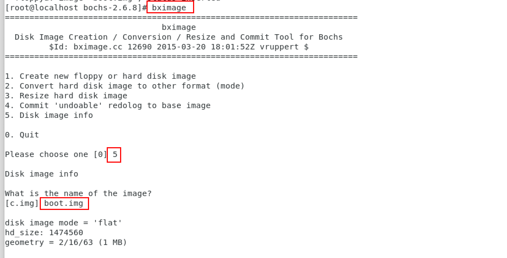

## Centos平台

dev on mac and build on centos.

### 1 Centos安装

| Name              | Version | Link                                            |
| ----------------- | ------- | ----------------------------------------------- |
| vmware fusion pro | 13      |                                                 |
| Centos iso        | 7       | http://mirrors.aliyun.com/centos/7/isos/x86_64/ |

### 2 工具链

| Name  | Version | Link                                                |
| ----- | ------- | --------------------------------------------------- |
| Bochs | 2.6.8   | https://sourceforge.net/projects/bochs/files/bochs/ |

#### 2.1 依赖库

```shell
yum install -y gcc gcc-c++ make SDL-devel wxGTK-devel libX11-devel gtk2-devel
```

#### 2.2 Bochs安装

官网上最新的版本是2.7，尝试编译了一次没有成功，因此选用较低版本2.6.8进行本地编译。

##### 2.2.1 下载

```shell
wget https://sourceforge.net/projects/bochs/files/bochs/2.6.8/bochs-2.6.8.tar.gz --no-check-certificate
```

##### 2.2.2 解压

```shell
cd /home/dingrui/Apps

tar zxvf bochs-2.6.8.tar.gz 
```

##### 2.2.3 config

官网参考https://bochs.sourceforge.io/doc/docbook/user/compiling.html

```shell
./configure \
--with-x11 \
--with-wx \
--enable-plugins \
--enable-debugger \
--enable-debugger-gui \
--enable-readline \
--enable-xpm \
--enable-show-ips \
--enable-logging \
--enable-assert-checks \
--enable-cpp \
--enable-idle-hack \
--enable-cpu-level=6 \
--enable-smp \
--enable-fpu \
--enable-3dnow \
--enable-x86-64 \
--enable-vmx \
--enable-svm \
--enable-avx \
--enable-x86-debugger \
--enable-monitor-mwait \
--enable-alignment-check \
--enable-configurable-msrs \
--enable-long-phy-address \
--enable-a20-pin \
--enable-large-ramfile \
--enable-repeat-speedups \
--enable-fast-function-calls \
--enable-handlers-chaining \
--enable-all-optimizations \
--enable-cdrom \
--enable-voodoo \
--enable-iodebug \
--enable-pci \
--enable-usb \
--enable-disasm \
--enable-ltdl-install \
--enable-trace-linking \
--enable-evex \
```

##### 2.2.4 compile

```shell
make
```

出现诸如下面的提示信息，就将对应路径的cpp后缀名改为cc后缀。


```shell
cp misc/bximage.cpp misc/bximage.cc
cp iodev/hdimage/hdimage.cpp iodev/hdimage/hdimage.cc
cp iodev/hdimage/vmware3.cpp iodev/hdimage/vmware3.cc
cp iodev/hdimage/vmware4.cpp iodev/hdimage/vmware4.cc
cp iodev/hdimage/vpc-img.cpp iodev/hdimage/vpc-img.cc
cp iodev/hdimage/vbox.cpp iodev/hdimage/vbox.cc
```

##### 2.2.5 bochs配置

```shell
vim boshsrc
```

涉及到的路径写绝对路径，bochs找不到相对路径对应的文件。

```shell
romimage: file=/home/dingrui/Apps/bochs-2.6.8/bios/BIOS-bochs-latest
vgaromimage: file=/home/dingrui/Apps/bochs-2.6.8/bios/VGABIOS-lgpl-latest
floppya: type=1_44, 1_44=/home/dingrui/Dev/my-os/a.img, status=inserted, write_protected=0
log: -

plugin_ctrl: unmapped=1, biosdev=1, speaker=1, extfpuirq=1, parallel=1, serial=1, iodebug=1
config_interface: textconfig
display_library: x
boot: floppy
floppy_bootsig_check: disabled=0
ata0: enabled=1, ioaddr1=0x1f0, ioaddr2=0x3f0, irq=14
ata0-master: type=none
ata0-slave: type=none
ata1: enabled=1, ioaddr1=0x170, ioaddr2=0x370, irq=15
ata1-master: type=none
ata1-slave: type=none
ata2: enabled=0
ata3: enabled=0
pci: enabled=1, chipset=i440fx
vga: extension=vbe, update_freq=5

cpu: count=1:1:1, ips=4000000, quantum=16, model=corei7_haswell_4770, reset_on_triple_fault=1, cpuid_limit_winnt=0, ignore_bad_msrs=1, mwait_is_nop=0, msrs="msrs.def"

cpuid: x86_64=1, level=6, mmx=1, sep=1, simd=avx512, aes=1, movbe=1, xsave=1, apic=x2apic, sha=1, movbe=1, adx=1, xsaveopt=1, avx_f16c=1, avx_fma=1, bmi=bmi2, 1g_pages=1, pcid=1, fsgsbase=1, smep=1, smap=1, mwait=1, vmx=1
cpuid: family=6, model=0x1a, stepping=5, vendor_string="GenuineIntel", brand_string="Intel(R) Core(TM) i7-4770 CPU (Haswell)"

print_timestamps: enabled=0
debugger_log: -
magic_break: enabled=0
port_e9_hack: enabled=0
private_colormap: enabled=0
clock: sync=none, time0=local, rtc_sync=0
logprefix: %t%e%d
debug: action=ignore
info: action=report
error: action=report
panic: action=ask
keyboard: type=mf, serial_delay=250, paste_delay=100000, user_shortcut=none
mouse: type=ps2, enabled=0, toggle=ctrl+mbutton
speaker: enabled=1, mode=system
parport1: enabled=1, file=none
parport2: enabled=0
com1: enabled=1, mode=null
com2: enabled=0
com3: enabled=0
com4: enabled=0

megs: 2048
```

###### 2.2.1.6 启动

```shell
./bochs -f /home/dingrui/Dev/my-os/bochs/boshsrc
```


### 3 虚拟软盘

#### 3.1 创建


#### 3.2 验证



### 4 程序文件写入磁盘

#### 4.1 boot引导区程序

```shell
nasm boot.asm -o boot.bin

dd if=boot.bin of=boot.img bs=512 count=1 conv=notrunc
```


#### 4.2 loader程序

```shell
mkdir -p /mnt/floppy/

mount boot.img /mnt/floppy/ -t vfat -o loop

cp loader.bin /mnt/floppy/

sync

umount /mnt/floppy/
```


### 5 宿主机虚拟机文件拷贝

#### 5.1 新建item2的profile


#### 5.2 虚拟机连接配置


#### 5.3 scp文件传输

防止出现权限问题，虚拟机直接以root用户接收

```shell
scp -r local_older remote_username@remote_ip:remote_folder 

scp local_file remote_username@remote_ip:remote_folder 
```


#### 5.4 ssh登陆


### 6 开发调试

#### 6.1 宿主机开发

#### 6.2 源码上传虚拟机

规划的是c程序和asm程序不组织在一个文件夹，因此将整个工程上传。


#### 6.3 虚拟机调试

进入到项目根目录下的bootloader文件夹，里面有makefile。

执行make程序，注意点有2个

* bochs程序有gui依赖，只能使用虚拟机终端，使用ssh的时候会报没有gui依赖的错误
* make程序交互创建软盘镜像的时候指定的名字一定要和makefile中以及boshsrc中的一致

