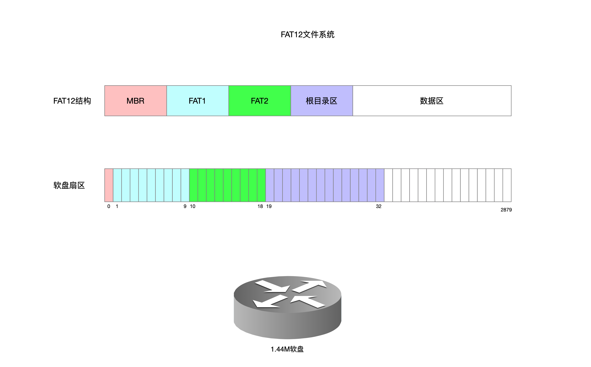
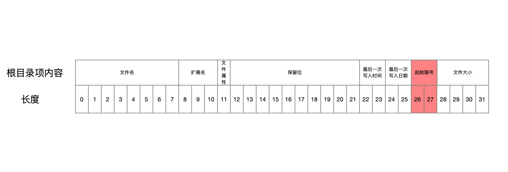

## FD

### 1 软盘

1.44M标准软盘

2880个扇区

每个扇区512B

容量=2880*512=1474560Byte=1440KB

### 2 文件系统

将软盘格式化成FAT12文件系统 

FAT12文件系统会对软盘扇区进行结构化管理 

将扇区划分为4个部分

#### 2.1MBR引导区

不仅包含引导程序，还包含FAT12文件系统的整个组成构成信息

这些信息描述了FAT12文件系统对磁盘扇区的管理情况

| 名称            | 偏移 | 长度(字节) | 内容                                       | 值                        |
| --------------- | ---- | ---------- | ------------------------------------------ | ------------------------- |
| BS_jmpBoot      | 0    | 3          | 跳转指令                                   | jmp short Label_Start nop |
| BS_OEMName      | 3    | 8          | 生产厂商名                                 | 'MINEboot'                |
| BPB_BytesPerSec | 11   | 2          | 每扇区字节数                               | 512                       |
| BPB_SecPerClus  | 13   | 1          | 每簇扇区数                                 | 1                         |
| BPB_RsvdSecCnt  | 14   | 2          | 保留扇区数                                 | 1                         |
| BPB_NumFATs     | 16   | 1          | FAT表份数                                  | 2                         |
| BPB_RootEntCnt  | 17   | 2          | 根目录的目录项数                           | 224                       |
| BPB_TotSec16    | 19   | 2          | 总扇区数                                   | 2880                      |
| BPB_Media       | 21   | 1          | 介质描述符                                 | 0xf0                      |
| BPB_FATSz16     | 22   | 2          | 每FAT扇区数                                | 9                         |
| BPB_SecPerTrk   | 24   | 2          | 每磁道扇区数                               | 18                        |
| BPB_NumHeads    | 26   | 2          | 磁头数                                     | 2                         |
| BPB_HiddSec     | 28   | 4          | 隐藏扇区数                                 | 0                         |
| BPB_TotSec32    | 32   | 4          | 如果BPB_TotSec16为0 就由这个值记录总扇区数 | 0                         |
| BS_DrvNum       | 36   | 1          | 驱动器号                                   | 0                         |
| BS_Reserved1    | 37   | 1          | 保留 未使用                                | 0                         |
| BS_BootSig      | 38   | 1          | 扩展引导标记                               | 0x29                      |
| BS_VolID        | 39   | 4          | 卷序列号                                   | 0                         |
| BS_VolLab       | 43   | 11         | 卷标                                       | ‘boot loader’             |
| BS_FileSysType  | 54   | 8          | 文件系统类型                               | 'FAT12'                   |
| 引导代码        | 62   | 448        | 引导代码                                   |                           |
| 结束标志        | 510  | 2          | 结束标志0xaa55                             | 0xaa55                    |

#### 2.2 FAT表区

FAT文件系统以簇为单位来分配数据区的存储空间，数据区的簇号与FAT表的表项一一对应

FAT12文件系统的FAT表项宽度为12bit，因此得名FAT12文件系统

FAT表2与FAT表1完全一样，仅仅是备份而已

FAT1表占9个扇区

总大小=4608Byte
每个簇占12bit，则FAT1表中共3072个簇

数据区范围为扇区[33...2879]共计2847个扇区，每个簇映射一个扇区，足可以保证访问所有的数据区
并且每个簇12个bit 数据范围=[0...4096]，可以保证簇能够访问到FAT表中每个簇
每12bit为1个簇，FAT1被划分为一个数组，共3072个数据项，数组脚标=[0...3071]，每个数组元素都是12bit，代表的是下一个指向的簇脚标
簇脚标0和簇脚标1不可用
簇值=0xfff标识结尾

因此从下标[2...]开始映射扇区[33...]，就像链表一样，根据某个文件的起始簇号开始可以找到整个文件所有的先后簇号，并且每个簇号映射着物理层面的扇区，也就可以读取整个文件的所有内容

#### 2.3 根目录区

根目录区占14个扇区 [19...32]
每个根目录项占32B
根目录区中每个扇区可容纳512/32=16个根目录项

需要读取一个文件内容时，遍历根目录表中所有根目录项，根据文件名找到目标文件的起始簇号

有了起始簇号就可以以链表形式找到该文件所有簇号，根据簇号映射到扇区，逐个读取扇区内容即可

#### 2.4 数据区