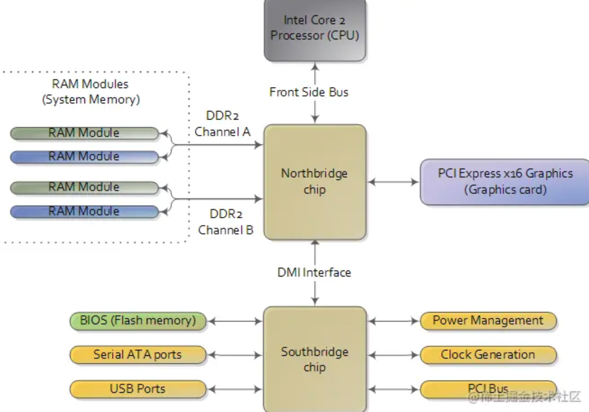
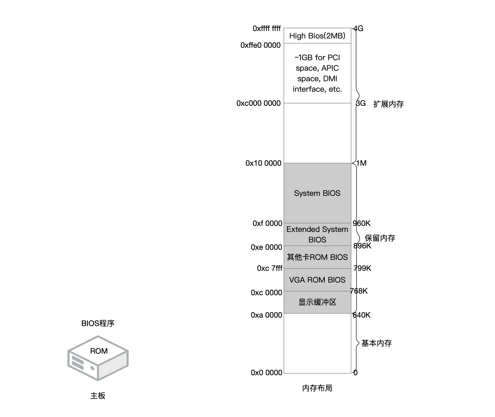
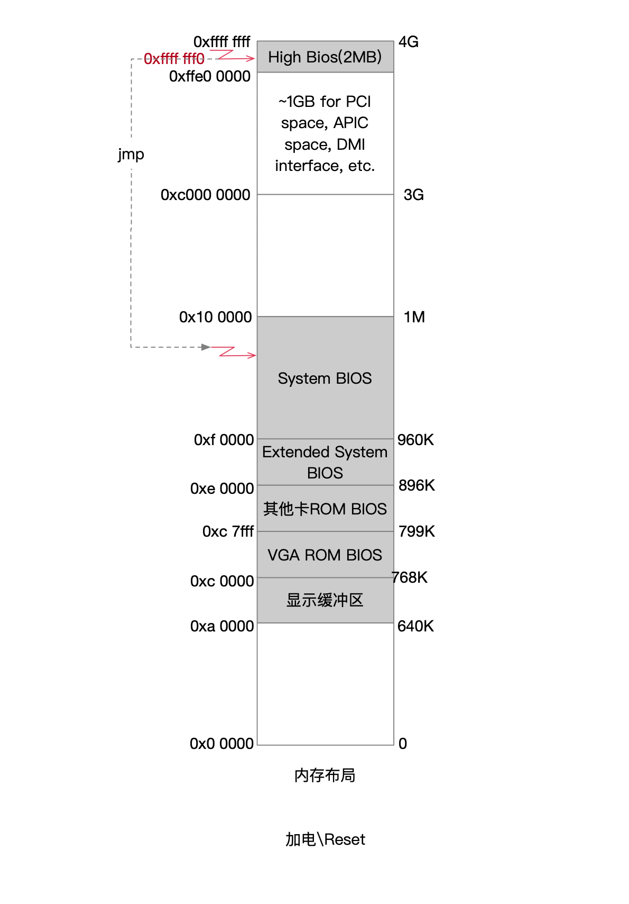
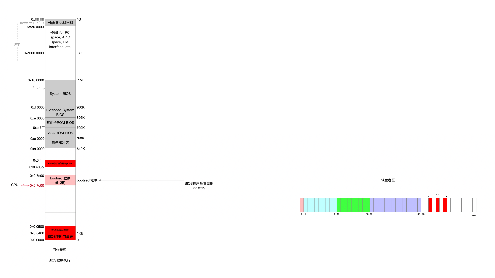
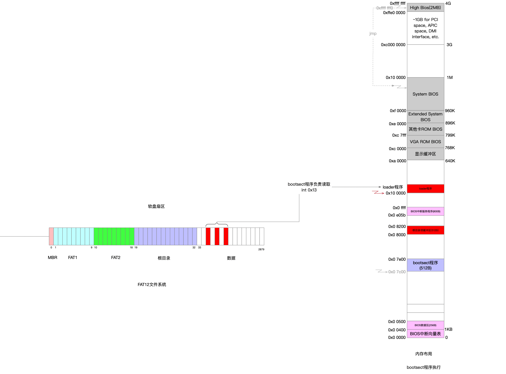

## MEM

内存布局情况，内存是个动态的组织结构，所以对内存的布局规划得结合各个时机来看

#### 4.0 内存映射

从CPU视角来看，它是不关注要通信的具体载体是什么，它只根据内存地址去通信

* CPU与外界的通信通过北桥总线
* CPU内部使用的内存地址是逻辑地址
* 总线上传输的地址是物理地址
* CPU先将逻辑地址转换成物理地址，再将要读写的物理地址告诉北桥总线

从北桥芯片组视角来看

* 它收到的地址信息是物理地址
* 当收到一个物理地址请求时，它要裁决何去何从，这个路由策略是由内存地址映射决定的

地址空间布局如下

#### 4.1 加电启动

假设CPU为32位

##### 4.1.1 计算机reset后CPU进入实模式

* CPU进入16位实模式下，数据总线宽度是20位

* 通过硬件逻辑层面的设计，将代码段寄存器CS的值置为0xf000，指令寄存器的值置为0xfff0
* 此时的16位实模式并非严格意义的实模式，此时的段地址隐藏的高位全部为1
* 逻辑地址转换为物理地址，CS=0xffff f000，PA=CS<<4+IP=0xffff fff0

##### 4.1.2 CPU寻址

* CPU将物理地址0xffff fff0通过北桥总线传给北桥芯片组

* 北桥解码后发现该地址没有被映射过，将物理地址请求交给南桥芯片组
* 南桥芯片发现该地址被BIOS的ROM映射过
* CPU读到了写在BIOS ROM中的数据，该数据是一个远跳指令

##### 4.1.3 指令跳转CPU进入实模式

* 该远跳指令具体跳到什么地址上由BIOS厂商决定，地址空间范围肯定在[0xe 0000...0x10 0000]
* CPU进入真正的16位实模式
* CPU从跳转后的地址开始执行BIOS程序

#### 4.2 BIOS程序

BIOS程序的设计由主板厂商决定，虽然会有差异不同，但是核心主体是一样的

* 硬件检测
* 布局内存，在内存中构建BIOS中断向量表和中断服务程序
* 假设通过软盘启动方式，那么BIOS还需要通过自己构建的BIOS中断，将软盘第一扇区内容读取到内存[]

以软盘做启动引导为例

* BIOS在[0...0x400]构建中断向量表，共256个中断向量，每个表项占4B，其中2个字节是CS值，2个字节是IP值，组合起来就是对应中断服务的地址

* BIOS将软盘第一扇区的512B内容读到内存[0x0 7c00...0x0 7dff]上
* BIOS读到最后1个word内容是0xaa55，判定这是启动引导程序，则跳转到0x0 7c00处，做好了执行bootsect程序的准备

我没有看过BIOS的源码，判定软盘第一扇区内容最后2字节后的伪代码应该如下

* 是引导盘扇区 jmp 0x0000:0x7c00
* 普通扇区 jmp $

#### 4.4 bootsect程序

以1.44M标准软盘为例

* 为软盘构建了FAT12文件系统
* 将文件系统中LOADER.BIN这个文件读到内存0x10 0000上
* bootsect程序jmp到0x10 0000地址，做好了执行loader程序的准备