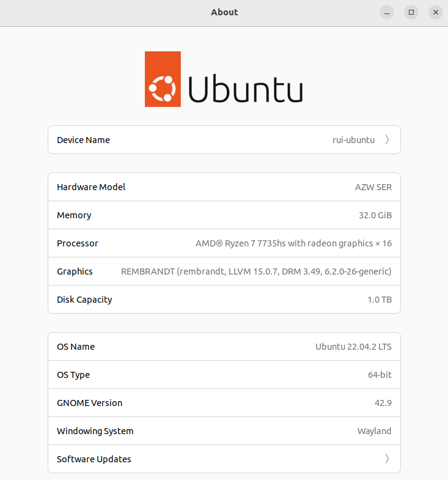
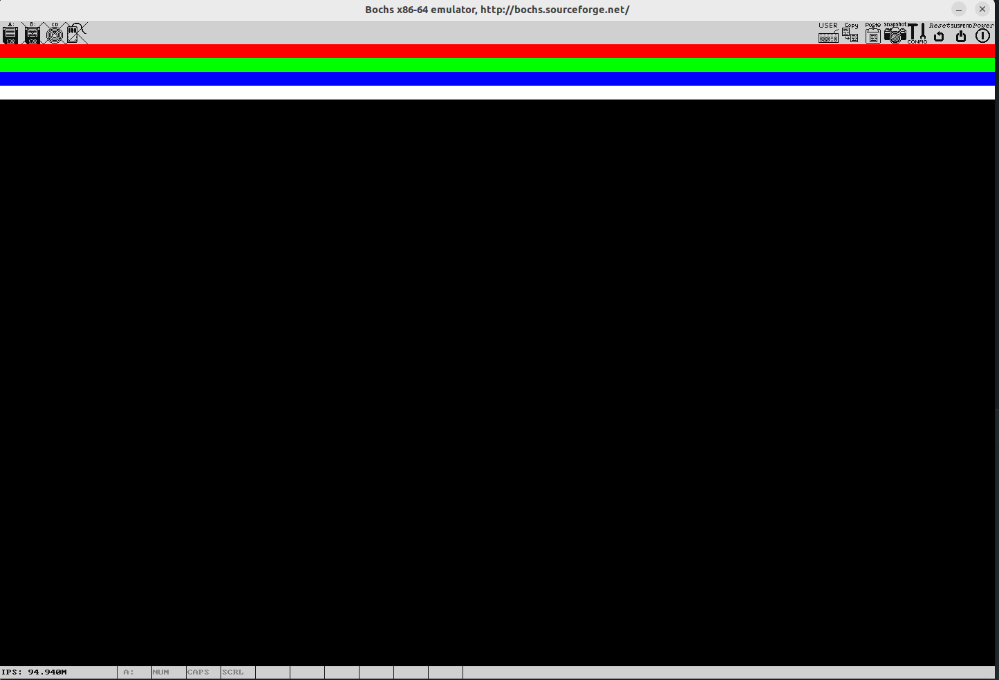

## Ubuntu

dev on ubuntu and build on ubuntu as well.



### 1 Bochs

#### 1.1 download

https://sourceforge.net/projects/bochs/files/bochs/2.7/

#### 1.2 build

```shell
cd Documents/softWare/bochs
cp ~/Downloads/bochs-2.7.tar.gz ./
tar -zxvf bochs-2.7.tar.gz

sudo apt update
sudo apt install libx11-dev libc6-dev build-essential xorg-dev libgtk2.0-dev libreadline-dev

make dist-clean
```

```shell
./configure \
--with-x11 \
--with-wx \
--enable-plugins \
--enable-debugger \
--enable-debugger-gui \
--enable-readline \
--enable-xpm \
--enable-show-ips \
--enable-logging \
--enable-assert-checks \
--enable-cpp \
--enable-idle-hack \
--enable-cpu-level=6 \
--enable-smp \
--enable-fpu \
--enable-3dnow \
--enable-x86-64 \
--enable-vmx \
--enable-svm \
--enable-avx \
--enable-x86-debugger \
--enable-monitor-mwait \
--enable-alignment-check \
--enable-configurable-msrs \
--enable-long-phy-address \
--enable-a20-pin \
--enable-large-ramfile \
--enable-repeat-speedups \
--enable-fast-function-calls \
--enable-handlers-chaining \
--enable-all-optimizations \
--enable-cdrom \
--enable-voodoo \
--enable-iodebug \
--enable-pci \
--enable-usb \
--enable-disasm \
--enable-ltdl-install \
--enable-trace-linking \
--enable-evex
```

```shell
make
```

##### 1.2.1 make[1]: *** No rule to make target 'parser.cc', needed by 'parser.o'.  Stop.

```shell
cp ./bx_debug/parser.cpp ./bx_debug/parser.cc
```

##### 1.2.2  debug.h:25:10: fatal error: config.h: No such file or directory

```shell
vim ./bx_debug/debug.h
```

#include "config.h" -> #include "../config.h"

##### 1.2.3 debug.h:26:10: fatal error: osdep.h: No such file or directory

```shell
vim ./bx_debug/debug.h
```

#include "osdep.h" -> #include "../osdep.h"

##### 1.2.4 debug.h:34:10: fatal error: cpu/decoder/decoder.h: No such file or directory

```shell
vim ./bx_debug/debug.h
```

 #include "cpu/decoder/decoder.h" ->  #include "../cpu/decoder/decoder.h"

##### 1.2.5 make: *** No rule to make target 'misc/bximage.cc', needed by 'misc/bximage.o'.  Stop.

```shell
cp misc/bximage.cpp misc/bximage.cc  
```

##### 1.2.6 make: *** No rule to make target 'iodev/hdimage/hdimage.cc', needed by 'misc/hdimage.o'.  Stop.

```shell
cp iodev/hdimage/hdimage.cpp iodev/hdimage/hdimage.cc  
```

##### 1.2.7 make: *** No rule to make target 'iodev/hdimage/vmware3.cc', needed by 'misc/vmware3.o'.  Stop.

```shell
cp iodev/hdimage/vmware3.cpp iodev/hdimage/vmware3.cc
```

##### 1.2.8 make: *** No rule to make target 'iodev/hdimage/vmware4.cc', needed by 'misc/vmware4.o'.  Stop.

```shell
cp iodev/hdimage/vmware4.cpp iodev/hdimage/vmware4.cc
```

##### 1.2.9 make: *** No rule to make target 'iodev/hdimage/vpc.cc', needed by 'misc/vpc.o'.  Stop.

```shell
cp iodev/hdimage/vpc.cpp iodev/hdimage/vpc.cc
```

##### 1.2.10 make: *** No rule to make target 'iodev/hdimage/vbox.cc', needed by 'misc/vbox.o'.  Stop.

```shell
cp iodev/hdimage/vbox.cpp iodev/hdimage/vbox.cc
```

##### 1.2.11 ~~shell script~~

do not rename `.cpp` file to `.cc` if no error.

```shell
#!/bin/bash

function rename_ext(){
    for f in `ls $1`
    do
        path=$1"/"$f
        if [ ! -d path ]
	then
            if test ${f##*.} = $oldext
            then
                base=${path%.$oldext}
                cp $path ${base}.$newext
            fi
        fi
    done
}

oldext="cpp"
newext="cc"
echo "cur dir=$1"
rename_ext $1
```

#### 1.3 install

```shell
sudo make install
```

#### 1.4  check

```shell
whereis bochs
whereis bximage

ls /usr/bin |grep 'bochs'
ls /usr/bin |grep 'bximage'

bochs --help cpu
```

#### 1.5 error

##### 1.5.1 execute path

do not use the src absolute execute path, using the link symbol path(/usr/bin)

```shell
BOCHS_FILE = /usr/bin/bochs
BXIMAGE = /usr/bin/bximage
```

##### 1.5.2 display_library

display_library: x not available

```shell
apt-cache search bochs-sdl

sudo apt update
sudp apt install bochs-sdl
```

change the config file

```shell
echo 'display_library: sdl2' >> /home/rui/myDev/code/c/my-os/bochs/boshsrc
```

### 2 my-os

```Make
AS = nasm

SRC_DIR = $(shell pwd)
BOCHS_CFG = $(SRC_DIR)/bochs/boshsrc
BOOT_FILE = $(SRC_DIR)/bootloader/boot.bin
LOADER_FILE = $(SRC_DIR)/bootloader/loader.bin
KERNEL_FILE = $(SRC_DIR)/kernel/kernel.bin

BOCHS_DIR = /home/rui/Documents/softWare/bochs
BOCHS_FILE = /usr/bin/bochs
BXIMAGE = /usr/bin/bximage

FLOPPY_MOUNT_POINT = $(SRC_DIR)/tmp/mount_point
FLOPPY_IMG = $(SRC_DIR)/tmp/my_os_floppy.img

default: kernel

boot: clean compile_boot
	@echo "check..."
	if [ ! -e ${BOCHS_CFG} ]; then echo "boshsrc not found" && exit 1;fi
	rm -rf $(FLOPPY_IMG)
	@echo "floppy..."
	$(BXIMAGE) -func=create -fd=1.44M $(FLOPPY_IMG)
	@echo "boot..."
	if [ ! -e ${BOOT_FILE} ]; then echo "boot.bin not found" && exit 1;fi
	dd if=$(BOOT_FILE) of=$(FLOPPY_IMG) bs=512 count=1 conv=notrunc
	@echo "starting..."
	$(BOCHS_FILE) -f $(BOCHS_CFG)

bootloader: clean compile_bootloader
	@echo "check..."
	if [ ! -e ${BOCHS_CFG} ]; then echo "boshsrc not found" && exit 1;fi
	rm -rf $(FLOPPY_IMG)
	@echo "floppy..."
	$(BXIMAGE) -func=create -fd=1.44M $(FLOPPY_IMG)
	@echo "boot..."
	if [ ! -e ${BOOT_FILE} ]; then echo "boot.bin not found" && exit 1;fi
	dd if=$(BOOT_FILE) of=$(FLOPPY_IMG) bs=512 count=1 conv=notrunc
	@echo "mount..."
	if [ ! -d ${FLOPPY_MOUNT_POINT} ]; then mkdir -p ${FLOPPY_MOUNT_POINT};fi
	sudo mount -t vfat -o loop --source $(FLOPPY_IMG) --target $(FLOPPY_MOUNT_POINT)
	@echo "loader..."
	if [ ! -e ${LOADER_FILE} ]; then echo "loader.bin not found" && exit 1;fi
	sudo cp $(LOADER_FILE) $(FLOPPY_MOUNT_POINT)/
	sync
	sudo umount $(FLOPPY_MOUNT_POINT)
	@echo "starting..."
	$(BOCHS_FILE) -f $(BOCHS_CFG)

kernel: clean compile_bootloader compile_kernel
	@echo "check..."
	if [ ! -e ${BOCHS_CFG} ]; then echo "boshsrc not found" && exit 1;fi
	rm -rf $(FLOPPY_IMG)
	@echo "floppy..."
	$(BXIMAGE) -func=create -fd=1.44M $(FLOPPY_IMG)
	@echo "boot..."
	if [ ! -e ${BOOT_FILE} ]; then echo "boot.bin not found" && exit 1;fi
	dd if=$(BOOT_FILE) of=$(FLOPPY_IMG) bs=512 count=1 conv=notrunc
	@echo "mount..."
	if [ ! -d ${FLOPPY_MOUNT_POINT} ]; then sudo mkdir -p ${FLOPPY_MOUNT_POINT};fi
	sudo mount -t vfat -o loop --source $(FLOPPY_IMG) --target $(FLOPPY_MOUNT_POINT)
	@echo "loader..."
	if [ ! -e ${LOADER_FILE} ]; then echo "loader.bin not found" && exit 1;fi
	sudo cp $(LOADER_FILE) $(FLOPPY_MOUNT_POINT)/
	@echo "kernel..."
	if [ ! -e ${KERNEL_FILE} ]; then echo "kernel.bin not found" && exit 1;fi
	sudo cp $(KERNEL_FILE) $(FLOPPY_MOUNT_POINT)/
	sync
	sudo umount $(FLOPPY_MOUNT_POINT)
	@echo "starting..."
	$(BOCHS_FILE) -f $(BOCHS_CFG)

compile_boot:
	$(AS) $(SRC_DIR)/bootloader/boot.asm -I$(SRC_DIR)/bootloader -o $(BOOT_FILE)

compile_bootloader:
	$(AS) $(SRC_DIR)/bootloader/boot.asm -I$(SRC_DIR)/bootloader -o $(BOOT_FILE)
	$(AS) $(SRC_DIR)/bootloader/loader.asm -I$(SRC_DIR)/bootloader -o $(LOADER_FILE)

compile_kernel: system
	# 剔除system程序里面多余的段信息 提取出二进制程序段数据 包括text段\data段\bss段
	objcopy -I elf64-x86-64 -S -R ".eh_frame" -R ".comment" -O binary kernel/system kernel/kernel.bin

system: head.o main.o
	# .o链接成可执行程序取名为system 链接过程中使用lds文件
	ld -b elf64-x86-64 -o kernel/system kernel/head.o kernel/main.o -T kernel/Kernel.lds

head.o: kernel/head.S
	gcc -E kernel/head.S > kernel/head.s
	as --64 -o kernel/head.o kernel/head.s

main.o: kernel/main.c
	gcc -std=c99 -mcmodel=large -fno-builtin -m64 -c kernel/main.c -o kernel/main.o

.PHONY: clean
clean:
	-rm -f $(BOOT_FILE)
	-rm -f $(LOADER_FILE)
	-sudo umount $(FLOPPY_MOUNT_POINT)
	rm -rf $(FLOPPY_MOUNT_POINT)/*
	-rm -rf $(FLOPPY_IMG)
	-rm -rf $(SRC_DIR)/kernel/*.s
	-rm -rf $(SRC_DIR)/kernel/*.o
	-rm -rf $(SRC_DIR)/kernel/*.bin
	-rm -rf $(SRC_DIR)/kernel/system
```

```shell
make
```


